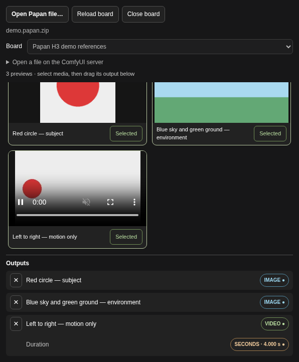

# Papan for ComfyUI

Open a [Papan](https://github.com/chelij/papan) file directly in **one Papan Board node**. The node shows **every image and video preview** from the selected board. Select media to add title-only IMAGE or VIDEO outputs below the gallery.

Protected files show a password popup. The extension opens only files you choose.

[Download ZIP](https://github.com/chelij/comfyui-papan/releases/latest) · [Papan](https://github.com/chelij/papan) · [Report an issue](https://github.com/chelij/comfyui-papan/issues)



## Install

Requires Python 3.11+, a recent ComfyUI with native VIDEO support, and a `.papan` or `.papan.zip` board. Verified on Linux with ComfyUI 0.37.0 / frontend 1.53.6 and ComfyUI Desktop's ComfyUI 0.39.0 / frontend 1.53.10, including Nodes 2.0. ComfyUI provides Pillow, PyAV, and aiohttp; this extension also uses `cryptography` for protected boards.

### Git

Clone this repository into the **active installation's** `custom_nodes` folder:

```sh
cd /path/to/ComfyUI
git clone https://github.com/chelij/comfyui-papan.git custom_nodes/comfyui-papan
```

Install the requirement with **the Python that runs that ComfyUI installation**. For a Linux installation with a `.venv`:

```sh
.venv/bin/python -m pip install -r custom_nodes/comfyui-papan/requirements.txt
```

For Windows portable, from `ComfyUI_windows_portable`:

```powershell
git clone https://github.com/chelij/comfyui-papan.git ComfyUI/custom_nodes/comfyui-papan
python_embeded\python.exe -m pip install -r ComfyUI/custom_nodes/comfyui-papan/requirements.txt
```

Restart ComfyUI and refresh its window. Add **Papan → Papan Board**.

### ZIP

Download the extension ZIP from [Releases](https://github.com/chelij/comfyui-papan/releases/latest) and extract it into `ComfyUI/custom_nodes/`. The resulting folder must be `custom_nodes/comfyui-papan/`, with `__init__.py` directly inside it. Install the requirement and restart as above.

For ComfyUI Desktop, use the installation folder belonging to the instance you launch. A separate ComfyUI checkout can have a different `custom_nodes` folder. Install only one copy of the extension. To replace an existing ZIP installation, back up its extension folder and replace it with the new release; leave ComfyUI's input files and workflows in place.

### Update a Git installation

```sh
git -C /path/to/ComfyUI/custom_nodes/comfyui-papan pull --ff-only
```

Install requirements with ComfyUI's Python again if they changed, then restart ComfyUI and refresh its window.

## Choose a board

Add **Papan → Papan Board** from ComfyUI's node menu, then click **Open Papan file…** on the node. Choose a saved `.papan` list, encrypted `.papan` file, or portable `.papan.zip` export. Protected files show a password popup; an incorrect password lets you retry or cancel.

You can open several boards and switch between them. For large files already on the server, expand **Open a file on the ComfyUI server** and enter the full file path. This also avoids uploading another copy. The extension never searches for Papan libraries or uses environment variables to discover them.

Ordinary `.papan` lists reference saved media by absolute path. Those files must be accessible to the **ComfyUI server**, even when the list is selected in a browser on another machine. Portable `.papan.zip` and encrypted `.papan` files include their media and work across machines. Uploads are limited to 512 MiB; use the server file path for larger boards. Each media file is limited to 512 MiB, matching Papan.

Opening a file loads a snapshot. Click **Reload board** to refresh a file opened by server path; choose an updated local file again to refresh an upload. No running Papan process or account is required.

## Connect references

1. Open a file on the node and select its board. All previews appear automatically in the scrollable gallery, including previews beyond the first page. There is no preview-count limit.
2. Click a preview or its **Select** button. Its title and **IMAGE ●** or **VIDEO ●** connector appear in **Outputs**, below the scrolling gallery. Selecting a video starts its preview automatically, muted and looping.
3. Drag an output connector to a compatible input. Select several media items from the same node as separate references. Output rows stay visible while you scroll; the node grows to fit them.
4. Run the workflow. Only connected media is loaded at full resolution. Playing a video also copies that clip for playback.

Each selected video also has a **SECONDS ●** output (FLOAT), showing its duration once the preview loads or the workflow runs. Drag it to a video generator's duration input, such as the socket beside H3 Easy's **Seconds** widget. The value comes from the same clip as the VIDEO output, including when SECONDS is the only connected output. It keeps fractional seconds; the downstream model's duration limits and frame rounding still apply.

Click the same preview or its **Selected** button again to deselect it, stop playback, and remove its media/duration outputs and connections. **×** on an output does the same. Other references keep their output indices.

You can explicitly open several files in one node and switch boards. Selected output titles remain below the gallery across board switches and workflow reloads. Previews removed from the source board keep existing connected outputs so a saved reference is not silently rewired. Files saved by Papan represent individual boards.

MiniMax H3 Easy accepts multiple image/video connections through its Media input. Use H3's index reference mode (`<Picture 1>`, `<Video 1>`, etc.) to distinguish references from the same board node. The downstream model's reference limits still apply.

For nodes that expect video frames as an IMAGE tensor, connect VIDEO through ComfyUI's **Get Video Components** node. The extension uses native IMAGE/VIDEO types and has no dependency on an H3 node pack.

Saved originals take priority; cached previews are used when originals are missing or unreadable. Online boards may only contain reduced previews. Still images become PNG files with orientation and transparency preserved; animated images use their first frame. Clips retain their original container, frames, timing, and audio. Missing media needs to be restored in Papan or included in a fresh portable export.

## Protected boards and workflow storage

Passwords are sent to the ComfyUI server only for unlocking. Passwords and session tokens are never saved in workflow JSON or included in media filenames. Decryption uses Papan's existing scrypt and AES-256-GCM format. Unlocked keys and decrypted thumbnails remain in memory; session responses disable browser caching.

**Connected references become unencrypted files under `papan/` in ComfyUI's configured input directory** (normally `ComfyUI/input/papan/`). Workflow JSON stores preview titles, board/item IDs, media kinds, source descriptors, filenames for imported references, and duration-output mappings/display values. Metadata for protected boards is therefore visible in a saved workflow after unlocking. Imported references remain usable after locking, closing, or restarting. Delete those input copies when no longer needed.

Uploaded board files are retained under `papan/boards/` in that input directory so workflows can reopen them. Protected uploads stay encrypted. Plain boards reopen automatically; protected boards show **Unlock board** after a reload. Save/copy these board and media input files alongside a workflow when moving it to another machine. Ordinary board lists still require their referenced media paths to be accessible on the new server.

Use **Lock board** or **Close board** to discard the node's session. Closing removes the temporary upload, while the retained board copy and imported media remain. Server-path originals are left intact. Sessions expire after 30 minutes of inactivity and are discarded on subsequent access or when another file opens. If a session expires, reload or unlock the board. Browser reloads close sessions where the browser can deliver the request. ComfyUI cleans its temporary directory on restart.

The extension makes no requests to source websites and never modifies the source board or its media. Its endpoints use ComfyUI's access arrangement. Use trusted ComfyUI access, particularly when entering passwords or opening server file paths.

## Try the included example

1. Load [`examples/Papan_References.json`](examples/Papan_References.json) in ComfyUI.
2. On its Papan Board node, click **Open Papan file…** and choose [`examples/demo.papan.zip`](examples/demo.papan.zip) from your downloaded ZIP or Git checkout.
3. Run the workflow to preview two images and the video frames. The reference connections are already wired. The video also exposes **SECONDS** for a compatible duration input.

The example uses synthetic shapes and ComfyUI's built-in preview/video nodes. It needs no model download or H3 extension. To use your own board, add a fresh Papan Board node, open your file, select references, and connect their outputs.

## Development and releases

This repository contains the standalone extension. Runtime code is `__init__.py`, `board.py`, `nodes.py`, and `web/`; no Papan application installation is required to read saved boards.

Run the format and endpoint tests with Python and Node.js 24:

```sh
python -m pip install Pillow av aiohttp cryptography
python -m unittest discover -s tests -v
node --input-type=module --check < web/papan.js
python scripts/package.py
```

The tests use Papan's native vault implementation to generate encrypted fixtures. They cover original/preview selection, video imports, portable bundles, wrong passwords, corrupted encrypted media, session expiry, retained uploads, and path containment.

`VERSION` controls the standalone ZIP filename. The packager writes the ZIP and SHA-256 file under `dist/`, excluding tests, bytecode, and development files. GitHub Actions runs the checks on Python 3.11 and 3.13. A tag matching `v` plus `VERSION` publishes the checked ZIP and checksum as a GitHub release; update `RELEASE_NOTES.md` before tagging.

Full ComfyUI execution and frontend checks were also run before v0.1.0: 143 previews, IMAGE/VIDEO/FLOAT dragging, exact video seconds and duration-only execution, stable output indices, board switching, saved workflows, deselection, autoplay, and password locking. Windows and macOS have not been directly tested for this release.

Licensed under **GPL-3.0-or-later**, like Papan.
